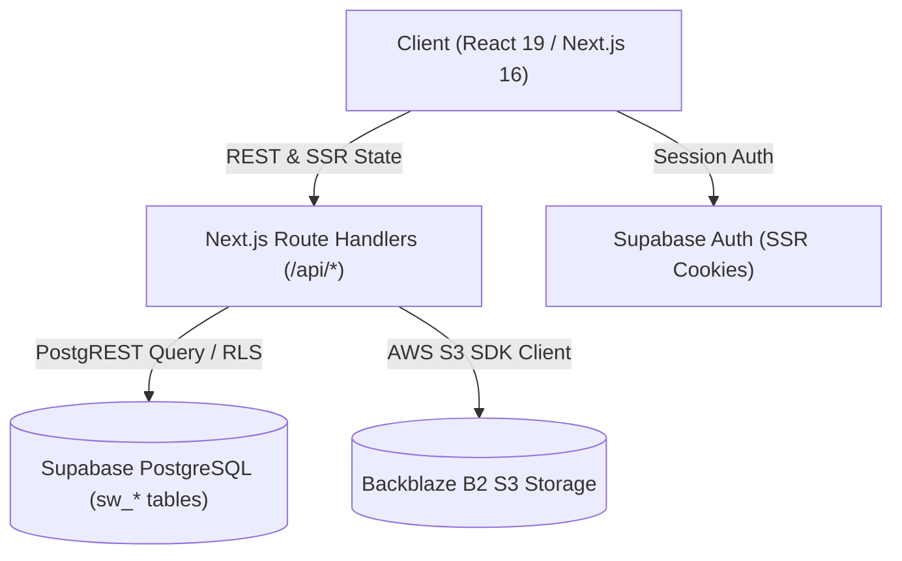

# 🏛️ CORE SPECS — SHARED WORK & LIFE HUB

> **Version:** 1.0.0  
> **Last Updated:** 2026-09-05  
> **Primary Purpose:** Comprehensive architectural blueprint, product vision, system invariants, and 1:1 module mapping for AI agents and human developers.

---

## 1. 🎯 Product Vision & Architecture

**Shared Work & Life Hub** là nền tảng quản trị công việc, dự án, sáng kiến và tri thức nhóm tinh gọn, lấy con người và sự tập trung làm trung tâm. Ứng dụng kết hợp sức mạnh của hệ thống quản lý công việc hiện đại với khả năng lưu trữ tệp tin đám mây bảo mật và phân quyền đa không gian (Multi-Workspace).

### Core Pillars
1. **Multi-Workspace Isolation**: Mỗi nhóm / gia đình / tổ chức sở hữu một không gian làm việc độc lập với vai trò quản trị (Admin / Member).
2. **Action-First Task Pipeline**: Hệ thống quản lý công việc tối giản, hỗ trợ gán việc thông minh bằng ký tự `@` và chọn nhanh 1 chạm.
3. **Decentralized Media Storage**: Sử dụng **Backblaze B2 Cloud Storage (S3-compatible API)** để lưu trữ ảnh, tài liệu đính kèm tốc độ cao, bảo mật với Private Bucket và Presigned Access URLs.
4. **Zero-Tech UI Philosophy**: Giao diện hoàn toàn thân thiện với người dùng cuối, nghiêm cấm hiển thị ID kỹ thuật, UUID, raw database keys hoặc stack traces.
5. **Full Dual-Language Support**: Hỗ trợ song ngữ Tiếng Việt (`vi`) & Tiếng Anh (`en`) theo thời gian thực.

---

## 2. 💻 Tech Stack & Infrastructure

- **Frontend**: Next.js 16.3.4 (App Router, Turbopack), React 19, Tailwind CSS v4, Lucide React icons.
- **State Management**: React Context (`HubContext`) kết hợp đồng bộ Polling / Optimistic UI.
- **Database & Auth**: Supabase PostgreSQL với tiền tố `sw_` cho toàn bộ schema và Row Level Security (RLS).
- **File Storage**: Backblaze B2 qua `@aws-sdk/client-s3` và `@aws-sdk/s3-request-presigner`.

---

## 3. 🗺️ 1:1 Module & Feature Map (Bản đồ liên kết 1:1)

Tất cả các tính năng và module đều có tài liệu đặc tả (**`SPECS.md`**) nằm trực tiếp bên trong thư mục mã nguồn tương ứng:

| Module / Khu vực | Đường dẫn thư mục mã nguồn | File đặc tả (Spec File) | Mô tả trách nhiệm |
| :--- | :--- | :--- | :--- |
| **Home / Dashboard** | [`src/components/home/`](file:///d:/Hoa%20Hoang/Apps/share_work_life_hub/src/components/home) | [`src/components/home/SPECS.md`](file:///d:/Hoa%20Hoang/Apps/share_work_life_hub/src/components/home/SPECS.md) | Màn hình tổng quan, việc cần bạn xử lý, nhật ký hoạt động có thể click |
| **Work Management** | [`src/components/work/`](file:///d:/Hoa%20Hoang/Apps/share_work_life_hub/src/components/work) | [`src/components/work/SPECS.md`](file:///d:/Hoa%20Hoang/Apps/share_work_life_hub/src/components/work/SPECS.md) | Quản lý công việc (Của tôi/Của Team/Đã xong), nhập nhanh với `@`, Modal chi tiết việc |
| **Projects** | [`src/components/projects/`](file:///d:/Hoa%20Hoang/Apps/share_work_life_hub/src/components/projects) | [`src/components/projects/SPECS.md`](file:///d:/Hoa%20Hoang/Apps/share_work_life_hub/src/components/projects/SPECS.md) | Không gian dự án, tabs (Tasks, Ideas, Files, Knowledge, Decisions, Log) |
| **Ideas Funnel** | [`src/components/ideas/`](file:///d:/Hoa%20Hoang/Apps/share_work_life_hub/src/components/ideas) | [`src/components/ideas/SPECS.md`](file:///d:/Hoa%20Hoang/Apps/share_work_life_hub/src/components/ideas/SPECS.md) | Phễu ấp ủ ý tưởng 4 giai đoạn, đính kèm tệp tin cho từng ý tưởng |
| **Activity Feed** | [`src/components/feed/`](file:///d:/Hoa%20Hoang/Apps/share_work_life_hub/src/components/feed) | [`src/components/feed/SPECS.md`](file:///d:/Hoa%20Hoang/Apps/share_work_life_hub/src/components/feed/SPECS.md) | Bảng tin hoạt động toàn nhóm theo thời gian thực |
| **More & Settings** | [`src/components/more/`](file:///d:/Hoa%20Hoang/Apps/share_work_life_hub/src/components/more) | [`src/components/more/SPECS.md`](file:///d:/Hoa%20Hoang/Apps/share_work_life_hub/src/components/more/SPECS.md) | Quản lý thành viên, lời mời, phân quyền Admin/Member, cài đặt thông báo |
| **Shared UI Components** | [`src/components/common/`](file:///d:/Hoa%20Hoang/Apps/share_work_life_hub/src/components/common) | [`src/components/common/SPECS.md`](file:///d:/Hoa%20Hoang/Apps/share_work_life_hub/src/components/common/SPECS.md) | AttachmentGallery, Lightbox, MentionAutocomplete, UserAvatar, Modals |
| **Layout & Nav** | [`src/components/layout/`](file:///d:/Hoa%20Hoang/Apps/share_work_life_hub/src/components/layout) | [`src/components/layout/SPECS.md`](file:///d:/Hoa%20Hoang/Apps/share_work_life_hub/src/components/layout/SPECS.md) | Top Header, Workspace Switcher, Desktop Sidebar, Mobile Bottom Bar |
| **Global Context State** | [`src/context/`](file:///d:/Hoa%20Hoang/Apps/share_work_life_hub/src/context) | [`src/context/SPECS.md`](file:///d:/Hoa%20Hoang/Apps/share_work_life_hub/src/context/SPECS.md) | HubContext state, polling synchronization, optimistic updates |
| **Backend Services** | [`src/lib/services/`](file:///d:/Hoa%20Hoang/Apps/share_work_life_hub/src/lib/services) | [`src/lib/services/SPECS.md`](file:///d:/Hoa%20Hoang/Apps/share_work_life_hub/src/lib/services/SPECS.md) | B2 S3 Storage, Supabase Mutations, Date Utils |
| **API Endpoints** | [`src/app/api/`](file:///d:/Hoa%20Hoang/Apps/share_work_life_hub/src/app/api) | [`src/app/api/SPECS.md`](file:///d:/Hoa%20Hoang/Apps/share_work_life_hub/src/app/api/SPECS.md) | REST Routes: attachments, tasks, projects, ideas, workspaces, members |
| **Internationalization** | [`src/lib/i18n/`](file:///d:/Hoa%20Hoang/Apps/share_work_life_hub/src/lib/i18n) | [`src/lib/i18n/SPECS.md`](file:///d:/Hoa%20Hoang/Apps/share_work_life_hub/src/lib/i18n/SPECS.md) | Từ điển Tiếng Việt (`vi.ts`) & Tiếng Anh (`en.ts`), i18n hook |

---

## 4. 🔒 System Invariants & Global Rules

1. **Tuyệt đối không hiển thị thông tin kỹ thuật trên UI**:
   - Nghiêm cấm render UUID, `prof-xxx`, `ws-xxx`, database primary keys, stack traces hoặc chuỗi raw error từ PostgreSQL.
   - Luôn sử dụng Tên hiển thị (`user.name`), Email, Tên dự án, hoặc thông báo tiếng Việt/Anh thân thiện.
2. **Quy tắc Git**:
   - Tuyệt đối **không được tự ý `git commit` hoặc `git push`** trừ khi có yêu cầu rõ ràng từ người dùng.
3. **Quy tắc lưu trữ tệp tin (Backblaze B2)**:
   - Tất cả tệp tải lên đều được lưu tại đường dẫn chuẩn: `attachments/{entity_type}/{entity_id}/{timestamp}_{random}_{filename}`.
   - Bucket ở chế độ `Private`, link truy xuất phải thông qua Presigned Signed URLs (thời hạn 24h hoặc on-demand).
   - Ảnh được render qua thumbnail tỉ lệ 16:9 với tính năng Lightbox Modal phóng to toàn màn hình, chuyển ảnh Next/Prev và tải về trực tiếp.
4. **Quy chuẩn Thiết kế UI/UX Tinh gọn & Nhất quán**:
   - **Giao diện cực kỳ đơn giản & Style nhất quán**: Bo góc mềm mại (`rounded-2xl`, `rounded-3xl`), border mỏng nhẹ (`border-zinc-200 dark:border-zinc-800`), đổ bóng nhẹ (`shadow-xs`).
   - **Gom gọn & Không Box-in-Box**: Tuyệt đối không lồng ghép nhiều khung viền con bên trong khung viền mẹ; padding/margin tối ưu, phẳng và thoáng đãng.
   - **Chữ nghĩa ít — Ưu tiên Icon trực quan**: Hạn chế văn bản rườm rà, ưu tiên các icon có ngữ nghĩa cao (📎, 💬, 🚩, 📁, 📅, 👤).
   - **Dùng màu sắc phân loại trạng thái**:
     - 🔴 **Đỏ / Rose**: Khẩn cấp (Urgent), quá hạn (Overdue), xóa, cảnh báo.
     - 🟠 **Cam / Amber**: Đang làm (In Progress), ý tưởng mới (Idea), ưu tiên cao.
     - 🔵 **Xanh dương / Blue**: Cần làm (Todo), công việc, primary action.
     - 🟢 **Xanh lá / Emerald**: Đã xong (Done), thành công, ý tưởng đã chuyển đổi.
     - 🟣 **Tím / Purple**: Đã lên kế hoạch (Planned), quyết định quan trọng.
     - ⚪ **Xám / Zinc**: Hộp thư (Inbox), ưu tiên thấp, thông tin phụ.

---

## 5. 📖 Guides & Detailed Rules Index

- [Quy tắc phát triển & Nguyên tắc cốt lõi](file:///d:/Hoa%20Hoang/Apps/share_work_life_hub/docs/RULES_AND_GUIDELINES.md)
- [Cấu hình Database Schema & RLS SQL](file:///d:/Hoa%20Hoang/Apps/share_work_life_hub/supabase/schema.sql)
- [Hướng dẫn cấu hình biến môi trường](file:///d:/Hoa%20Hoang/Apps/share_work_life_hub/.env.local)
