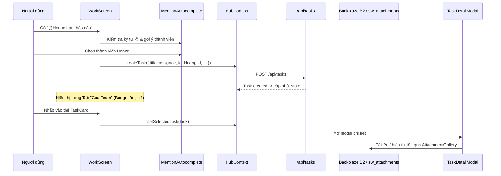

# 💼 MODULE SPECS: WORK & TASK MANAGEMENT

> **Location:** `src/components/work/`  
> **Core Spec Link:** [CORE_SPECS.md](file:///d:/Hoa%20Hoang/Apps/share_work_life_hub/docs/CORE_SPECS.md)

---

## 1. Mục đích & Vai trò
Module **Quản lý Công việc & Nhiệm vụ** chịu trách nhiệm toàn bộ vòng đời của công việc trong nhóm:
- Tạo nhanh công việc 1 dòng kết hợp bộ gõ gợi ý thành viên `@Mention` và thanh chọn Dự án / Deadline / Mức ưu tiên.
- Bộ lọc 3 tab thông minh: **Của tôi (My Work)**, **Của Team (Team Work)**, **Đã xong (Done)** kèm theo huy hiệu số lượng (Count Badges).
- Thẻ công việc trực quan (`TaskCard`) với checkbox hoàn thành, avatar người làm, thẻ dự án, hạn chót và đính kèm.
- Modal chi tiết công việc (`TaskDetailModal`) hỗ trợ đổi mọi trường thông tin, trao đổi bình luận thời gian thực và quản lý tệp tin đính kèm Backblaze B2 (`AttachmentGallery`).

---

## 2. Danh sách File mã nguồn Map 1:1

| File | Loại | Trách nhiệm |
| :--- | :--- | :--- |
| [`WorkScreen.tsx`](file:///d:/Hoa%20Hoang/Apps/share_work_life_hub/src/components/work/WorkScreen.tsx) | Component | Màn hình danh sách công việc, thanh thêm việc nhanh, bộ lọc 3 tab kèm badge đếm số lượng, ô tìm kiếm |
| [`TaskCard.tsx`](file:///d:/Hoa%20Hoang/Apps/share_work_life_hub/src/components/work/TaskCard.tsx) | Component | Thẻ hiển thị một công việc, xử lý click mở modal chi tiết, toggle status hoàn thành |
| [`TaskDetailModal.tsx`](file:///d:/Hoa%20Hoang/Apps/share_work_life_hub/src/components/work/TaskDetailModal.tsx) | Component | Modal xem/sửa chi tiết: Tiêu đề, mô tả, trạng thái (Inbox/Todo/In Progress/Done), người nhận việc, dự án, hạn chót, đính kèm B2, bình luận, xóa |

---

## 3. Luồng dữ liệu & Nghiệp vụ cốt lõi

### Quy tắc phân loại Tab:
- **Tab "Của tôi" (`my`)**: Các công việc có `task.status !== 'done'` VÀ `task.assignee_id === currentUser.id`.
- **Tab "Của Team" (`team`)**: Các công việc có `task.status !== 'done'` VÀ `task.assignee_id !== currentUser.id` (việc do bạn hoặc thành viên khác giao cho đồng đội).
- **Tab "Đã xong" (`done`)**: Tất cả công việc có `task.status === 'done'`.

---

## 4. Tích hợp Tệp đính kèm Backblaze B2
- Trong [`TaskDetailModal.tsx`](file:///d:/Hoa%20Hoang/Apps/share_work_life_hub/src/components/work/TaskDetailModal.tsx), nhúng component [`AttachmentGallery`](file:///d:/Hoa%20Hoang/Apps/share_work_life_hub/src/components/common/AttachmentGallery.tsx) với:
  `entityType="task"`, `entityId={selectedTask.id}`, `workspaceId={selectedTask.workspace_id}`.
- Cho phép tải lên hình ảnh/tài liệu tối đa 25MB/file, tự động lưu lên Backblaze B2 và liên kết vào bảng `sw_attachments`.
